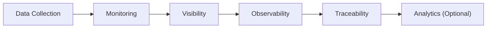
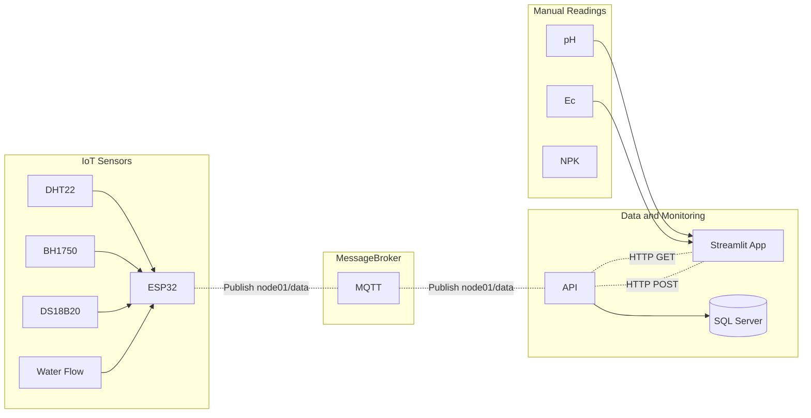

## Data Collection Layer (POC) - Phase 1 - Aurora
- Create a data collection layer for the a poc farm 
- After the collection is built see for monitoring, visibility, observability and traceability using basic sensors and dashboarding using Streamlit. Streamlit will act as a FE intake and dashboarding.
- Manually collect data for pH and Ec reading

## Data Collection - First Layer

---

| Concept | Main Question | Focus |
|----------|----------|----------|
| Monitoring  | What is happening now?  | Detection  |
| Visibility  | What can I see?  | Transparency  |
| Observability | Why did it happen? | Root Cause Analysis |
| Traceability | What happened to this thing over time? | Lineage & Impact Analysis |

## Data Flow

## Data Modeling

### Dim

- Node - mapping of the mac addresses? of the ESP32? encrypt
- Bed
- Zone
- Location
- Activity
- Users -> optional

### Sensors

Data
- temp
- humidity
- water temp
- water flowrate
- lux
- node_id - use the mac_address of the ESP32 - node of the sensor
- guid
- deleted_flag
- source - "SENSOR_MODULE"
- zone_id
- bed_id

### Streamlit App - Intake

Data  - Written on a paper then manually ingest thru streamlit
- pH and Ec
    - pH
    - Ec
    - Timestamp
    - Age of Data
    - zone_id
    - location
    - reservior
    - node_id - use the mac_address of the ESP32 - node of the sensor
    - bed_id - produce location
    - created_by
    - deleted_flag
    - guid
    - source - "MANUAL" 

- Activities
    - bed_id
    - zone_id
    - activity
    - notes
    - created by
    - timestamp
    - modified by
    - modidied date

